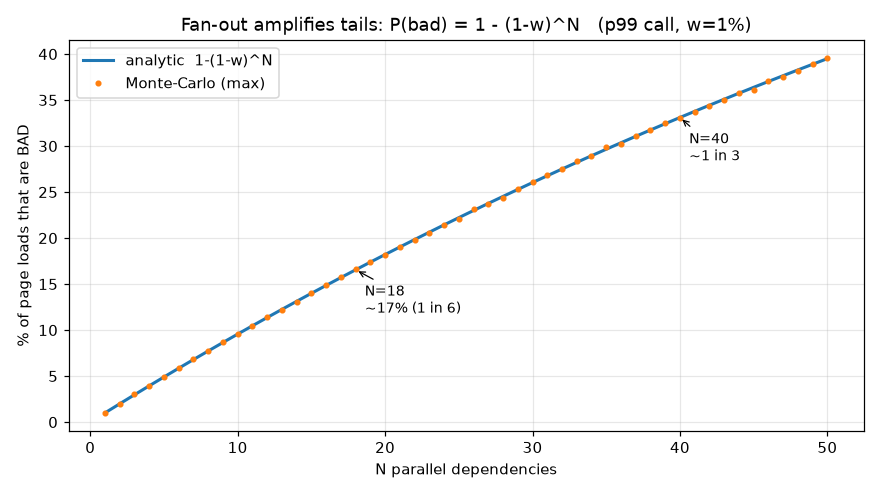
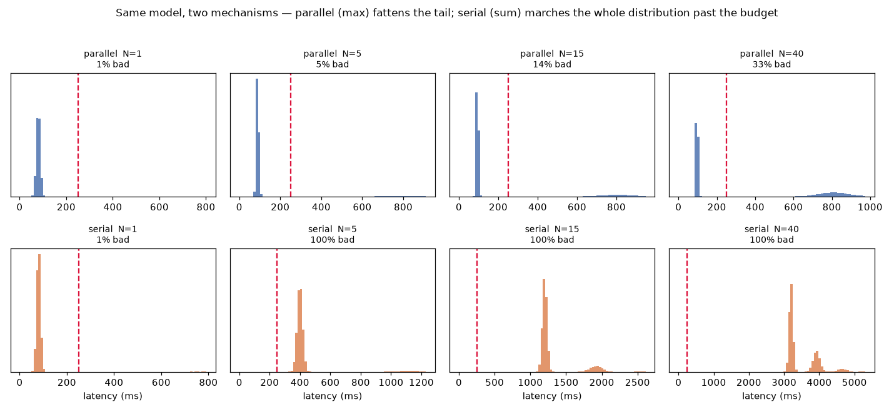

# Tail Scale

*"Our p99 is fine"* and *"one user in six has a bad time"* are the same
sentence. This is a toy demonstration for understanding why.

This isn't a new idea. Marc Brooker laid out the model it runs on in 2021, and
Dean and Barroso had named the effect eight years before that, in their classic
tail-at-scale paper. Both arrive at the same uncomfortable place: a system can
sit comfortably inside its percentiles while a real share of its users have a
slow experience in aggregate. This project builds on their work and lets you
watch it happen.

When we reason about latency, we often do so with an average in our heads, or that only one in a hundred calls are slow, and those can hide what's happening in the tail. What catches us out isn't arithmetic as much as tail latency is **distributional**. When mobile home screen or web page fires multiple calls to render itself, the share of slow results experienced by users climbs far faster than a single endpoint's dashboard might ever suggest.

## Run it


You can open [`index.html`](index.html) in any browser by double-clicking the file. It opens with a live strip of dots—one per backend, green while it is inside its SLO and flashing red when it draws its tail; the result is marked slow whenever any one dot is, and a counter shows the observed slow-rate converging on the predicted `1 − (1 − w)^N`. Below that it runs an in-browser Monte-Carlo with a guided story and a sandbox for you to play with the numbers.

If you prefer code, the numbers the web page is built on are taken from the code in `model.py` which you can run with `uv`:

```sh
uv run model.py
```

This prints an N-vs-P(bad) table, asserts the parallel result matches the analytic formula (and that hedging collapses the per-call miss to `w²`), and regenerates the plots below. And so `index.html` and `model.py` run the identical model, and `model.py` asserts the Monte-Carlo agrees with `1 − (1 − w)^N`.

### The controls

Each slider has an `i` you can hover in the page for the same note.

- **Parallel / Serial** — fan-out (wait on the slowest, a `max`) versus a dependent chain (a `sum`). They fail by different mechanisms; see below.
- **Dependencies (N)** — how many backends one client result waits on. In parallel this is the fan-out that drives everything, including the hero's `1 − (1 − w)^N`.
- **Per-call reliability** — each backend's own SLO. p99 means it is slow 1% of the time; that miss rate is `w`. Lower reliability (p95, p90) is a bigger `w`.
- **Tail-mode latency** — how slow a slow call is: the mean of the heavy mode, `N(slow, slow/10)` ms. Keep it above the budget or nothing counts as slow.
- **Latency budget** — your UX target; a result is bad past this line. It sits between the fast (~80 ms) and slow modes, so one tail call in the fan-out tips the result over.
- **Correlation** — the chance a shared dependency (a common cache, lock, or GC pause) stalls the whole fan-out at once. Independence is the optimistic floor; turn this up and the tail fattens past `1 − (1 − w)^N`. Applies to parallel fan-out.
- **Hedge slow calls** — the one fix the toy lets you try. Fire a backup to a second replica when the first is slow and take whichever returns first. A call is slow only if *both* tries are, so the per-call miss drops `w → w²` (a 1% tail becomes 0.01%). But it only holds while the two are independent—turn correlation up and `w²` collapses back toward `w`, because a shared stall hits both replicas at once.


## The intuition

If every independent call has a `w` chance of breaking a latency boundary (and so a
p99 call is `w = 1%`), the chance a whole client result stays quick falls with every
dependency:

```
P(good) = (1 − w)^N
P(bad) = 1 − (1 − w)^N
```

An 18-call fan-out at p99 would be `1 − 0.99¹⁸ ≈ 17%`. That means one result in six is bad, and nothing about the backend changed: it's still performing at 99 good calls in a 100. But when we add calls from the client we add more exposure and it's surprising how things mount up. The canonical case is harsher still [1]—a request touching 100 backends at p99 leaves only `0.99¹⁰⁰ ≈ 37%` of responses good. A mobile or web home screen is a milder, but everyday instance of the same issue.

And one in six counts results, not people. A user opens the app many times a day, so more than one in six will hit at least one slow screen—the per-user reality is worse than the per-result number, not better.

And p99 is maybe a generous case. Per-call reliability on mobile lives nearer
p90–p95 [3]: cellular radios wake slowly, connections start cold, people move in and out of good cell coverage. A fan-out of eight isn't remarkable: a typical request
fans out to about six backends, and an Amazon web page build touches 100–150 [2].
At p95 across eight calls the bad rate is already one result in three, but no
single endpoint will look unhealthy from monitoring.



## Parallel and serial fail by different mechanisms

This is the part the code and the web page aims to make visible, and a part that's easy to get wrong (I got it wrong in my first write-up for this idea):

- **Parallel** (fan-out, wait on the slowest) is a `max()`. One unlucky call
  drags the whole result, so the tail **fattens**: a once 1% event becomes
  common as N grows. `P(bad) = 1 − (1 − w)^N` is the model the code uses.

- **Serial** (a dependent chain) is a `sum()`. The tail gets averaged away [4].
  What blows the budget instead is the mean accumulating. Making 15 calls at
  80ms takes 1.2s, past a 250ms budget on the average alone, no slow calls are really required for that to stack up quickly.

A fan-out punishes the experience with variance; a chain punishes it with the mean. Parallel grows a second hump out at the tail, serial shoves the entire distribution past the budget:



## The model

Each call's latency is a mixture of two normals:

| mode | latency | weight |
|------|---------|--------|
| fast | `N(80, 8)` ms | `1 − w` |
| tail | `N(slow, slow/10)` ms (default `slow = 800`) | `w` |

A client result is bad when its aggregate latency—`max` for parallel, `sum` for
serial—exceeds a given budget (say 250ms). The tail mode is deliberately
heavy: a real 10–100× tail (a GC pause, a cold cache, a retry, a TCP
retransmit), not a polite 1.25× bump. Its *shape* is simplified too—a tidy
Gaussian bump, where real tails are heavier and lumpier (lognormal, power-law).
That makes the toy conservative: reality sits further out than this, not closer
in, so the bad rates here read as an underestimate.

The bimodal experiment—parallel as `max`, serial as `sum`—follows Marc
Brooker [5].

This is just a quick model to build intuition, and there are two caveats worth mentioning:

- Independence is often the optimistic case. `(1 − w)^N` assumes
  calls are uncorrelated. A shared backend, a common GC pause, a queue in a proxy,  or a saturated link means stalls become correlated. Now that can actually be sometimes better (if one stall covers many calls), but quite often it's going to be worse (one contested node on the path affects every fan-out).

- It's a teaching model, not a capacity planner. Real latency is multi-modal
  and rarely a sum of Gaussians. But if the concept lands, it should help you focus on the 'true' user experience as well as percentiles, where every service can work inside its SLO, while a good proportion of users have a slow experience.


## What helps, and when it backfires

The tool mostly shows the problem, but it lets you try one fix—the **hedge** toggle—and the correlation slider is there to show why even that fix is conditional. Two mitigations are worth knowing.

**Request hedging** [1]. Fire a backup to a second replica once the first misses a timing target, and take whichever returns first. If the two tries fail *independently*, a `w` tail drops to `w²`—a 1% miss becomes 0.01%. But that only holds while they're independent. If both are waiting on the same contended thing, `w²` collapses back to `w`, and you've added load to the resource that was already slow. (Likely why gRPC exposes client-side deadlines.) Flip the hedge toggle on in the sandbox, then turn correlation up and watch `w²` climb back toward `w` in real time.

**Power of two random choices** [6]. When you get to pick where a request goes, sample two candidates and send it to the less loaded one. It stops a hot spot forming rather than reacting to one—but you need two *real* choices to pick between.

The pattern underneath: you can engineer around an *independent* tail (retry it, hedge it), but you have to *design* around a correlated one (remove the shared dependency, spread the load). Turn the correlation slider up and watch the independent-case math stop protecting you—that's the regime where the cheap fixes quietly stop working.

## Notes and references

1. Jeffrey Dean and Luiz André Barroso, "The Tail at Scale," *Communications of
   the ACM* 56(2), 2013. The canonical statement: a request touching 100
   backends at p99 leaves only `0.99¹⁰⁰ ≈ 37%` of responses clean.
   <https://www.barroso.org/publications/TheTailAtScale.pdf>
2. Chris Richardson, "API Gateway / Backends for Frontends," microservices.io.
   A typical request fans out to about six backend calls; an Amazon page build
   touches 100–150 services. <https://microservices.io/patterns/apigateway.html>
3. "P50 vs P95 vs P99 Latency," OneUptime, 2025. "P95 is usually where mobile
   and high-latency network users live."
   <https://oneuptime.com/blog/post/2025-09-15-p50-vs-p95-vs-p99-latency-percentiles/view>
4. Add up enough independent calls and the total clusters tightly around N times
   the average—the rare slow one gets diluted by all the fast ones rather than
   dominating. (This is the Central Limit Theorem.)
5. Marc Brooker, "Tail Latency Might Matter More Than You Think," 2021. The
   bimodal parallel-vs-serial experiment this toy runs follows his.
   <https://brooker.co.za/blog/2021/04/19/latency.html>
6. Michael Mitzenmacher, Andréa Richa & Ramesh Sitaraman, "The Power of Two
   Random Choices: A Survey of Techniques and Results," 2001.

## License

MIT—see [LICENSE](LICENSE).
